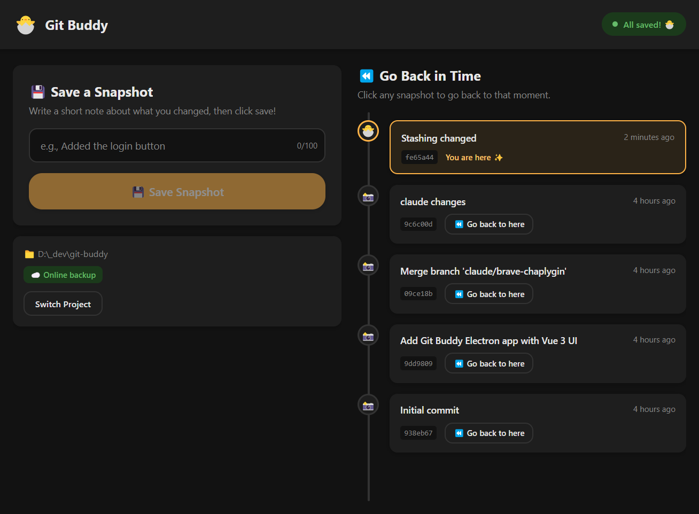

# Git Buddy 🐣

A super simple Git GUI for beginners. Only two actions: **Save a Snapshot** and **Go Back in Time**.

No branches, no merge conflicts, no terminal commands. Just save your work and go back if you need to.



## Features

- **Save a Snapshot** - Write a short note, click save. Your work is backed up.
- **Go Back in Time** - See all your save points. Click one to go back to it.
- **Auto-detect changes** - See at a glance if you have unsaved work.
- **Works with or without GitHub** - Pushes online if a remote is configured, works locally if not.

## Development

```bash
npm install
npm run dev
```

## Building

```bash
# Windows
npm run package:win

# macOS (Apple Silicon)
npm run package:mac

# Both
npm run package:all
```

## Tech Stack

- Electron + Vue 3 + TypeScript
- electron-vite for development and building
- electron-builder for packaging
